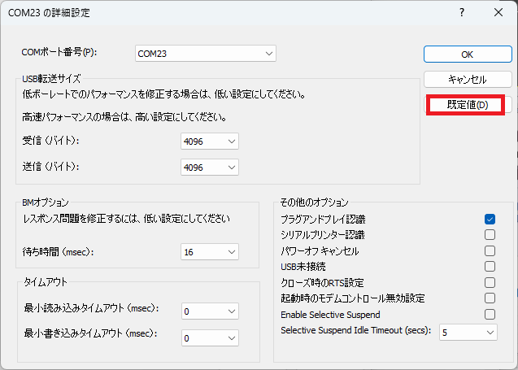
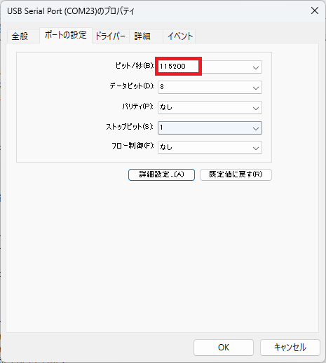

# update-firmware

セルラーモジュールのファームウェアをアップデートするためのスケッチです。

## 手順

1. **update-firmware.ino**をWio BG770Aにアップロードします。

1. セルラーモジュールのファームウェアのレビジョンを確認します。

    1. USER LEDが点滅しているときは、USERボタンをクリックします。（セルラーモジュールの電源をオンします。）

    1. シリアルモニタで`AT+QGMR`を実行します。

        ```
        AT+QGMR
        BG770AGLAAR02A05_JP_01.001.01.001
        ```

1. QFlashの設定を変更します。

    ファームウェアの書き込み途中にタイムアウトエラーが発生するときがあるので、タイムアウト時間を長くしておきます。

    1. **MainConfig.ini**の`ALTAIR_MaxDLTime=500`を`ALTAIR_MaxDLTime=1000`に変更します。

1. セルラーモジュールのファームウェアをアップデートします。

    1. Wio BG770AのUSBケーブルを外します。

    1. WioBG770A_UpdateAdapterをWio BG770Aに結線します。

        * DBG_TXD
        * DBG_RXD
        * VDD_EXT_1V8
        * GND

        

    1. WioBG770A_UpdateAdapterのRECOVERYスイッチを矢印方向と反対に切り替えます。

    1. WioBG770A_UpdateAdapterとPCをUSBケーブルで接続します。

    1. WioBG770AとPCをUSBケーブルで接続します。

    1. QFlashを起動して、書き換えをスタートします。

    1. QFlashに"Please reset..."と表示されるまで待ちます。

        

    1. WioBG770AのUSERボタンをクリックします。すると、ダウンロードが開始されます。

        ダウンロードが開始されず、"FAIL, Check chip info time out"というエラーが発生したときは、COMの詳細設定を既定値にして、ボーレートを115200にしてから、再度試してください。

        
        

    1. QFlashに"PASS"と表示されるまで待ちます。（540秒ほどかかります。）

        

    1. セルラーモジュールが自動的に再起動します。

    1. シリアルモニタで`AT+QGMR`を実行します。

        ```
        AT+QGMR
        BG770AGLAAR02A05_JP_01.200.01.200
        ```

    1. Wio BG770AのUSBケーブルを外します。

    1. WioBG770A_UpdateAdapterのUSBケーブルを外します。
